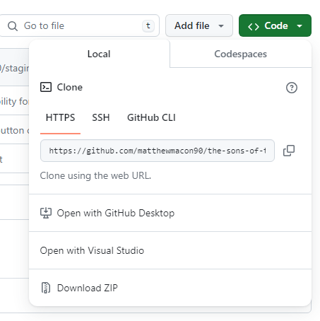

# Sons-of-Thunder

Welcome to the Sons-of-Thunder project! This platform is designed for the passionate gamers of World of Warcraft and other games, offering a personalized space to showcase your gaming achievements, stats, characters, and more. Join us in fostering a vibrant community built by gamers, for gamers.

## Getting Started

Follow these instructions to set up the project locally and embark on your development journey.

### Prerequisites
- Ensure you have **Node.js (v16 or higher)** installed on your system.
- Clone the repository to your local machine:
```Bash
git clone https://github.com/your-username/Sons-of-Thunder.git
```
    


### Installation

- **Frontend Setup:**
Navigate to the `frontend` directory and run the following command to install all dependencies:
```Bash
npm install
```

- **Backend Setup:**
- If you're on Windows, install **WSL (Ubuntu)** to enable running Ubuntu from the command line.
- With Ubuntu set up, install **PostgreSQL** using the command line:
  ```
  sudo apt-get install postgresql
  ```
- Move to the `backend` directory and install the necessary packages:
  ```
  npm install
  ```

## Usage

To get the application up and running, follow these steps:

1. Start the PostgreSQL service (you might need your password):


## Usage

Before running the server and client you will need to run postgresql for your db. 
Enter: sudo service postgresql start 

Note: You will most likely need a password.

In the backend directory within ubuntu enter command nodemon server.js to run the server locally.

In the frontend directory enter command npm start to run the client locally.

## Built With

We used React for the frontend and Express for the backend of the application.


## Acknowledgments

I want to acknowledge and thank Christian Feier, a friend and mentor, who has provided support and technical advice as I have worked on this project.
